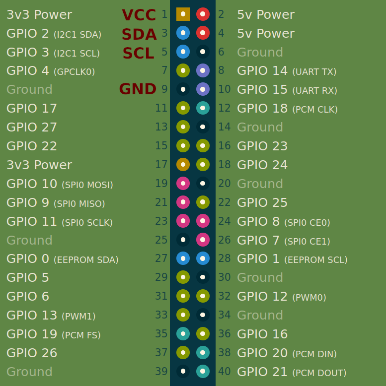

### Building locally

```docker compose build --progress=plain```

### Uploading to balena fleet

```balena push myFleet```

### Run container locally

```docker run -it docker-tensorflow-aarch64 s```

### SSH to BalenaOS device

```ssh -p 22222 root@192.168.2.9```

### Run container on balenaOS device

```balena-engine exec -it <container_id> /bin/sh```

### Copy file from balenaOS container to local device

```
balena-engine cp 32bc8338addf:/root/sensor.py /tmp/sensor.py
scp -P 22222 root@192.168.2.9:/tmp/sensor.py ./sensor.py
```

## Pinout


